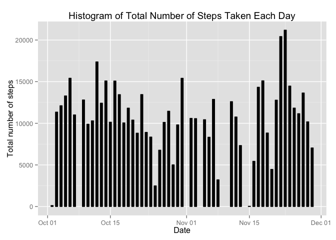
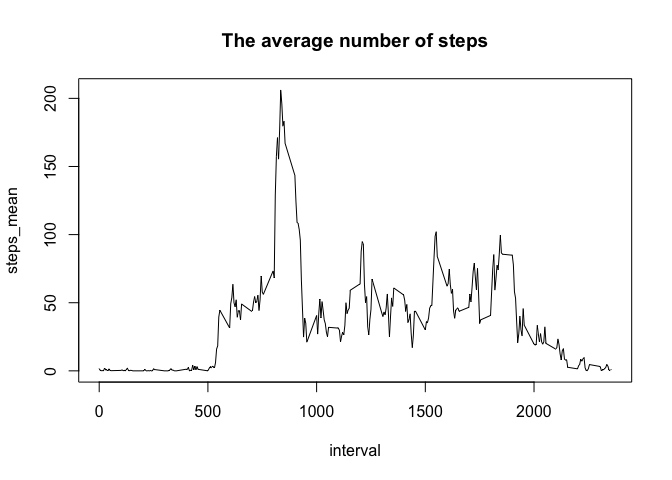
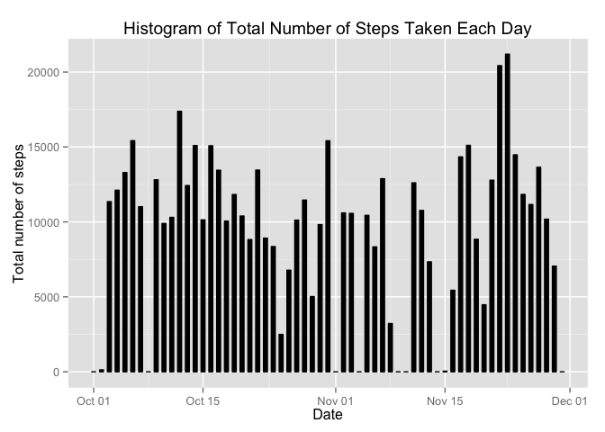

# Reproducible Research: Peer Assessment 1

## Loading and preprocessing the data

### Prerequisites


```r
echo = TRUE
#install.packages("ggplot2") # install them if you haven't already
#install.packages("lattice")
library(ggplot2)
library(lattice)
```

### Load the data (i.e. read.csv())

```r
unzip("activity.zip")
dataOriginal <- read.csv("activity.csv", header=TRUE)
head(dataOriginal)
```

```
##   steps       date interval
## 1    NA 2012-10-01        0
## 2    NA 2012-10-01        5
## 3    NA 2012-10-01       10
## 4    NA 2012-10-01       15
## 5    NA 2012-10-01       20
## 6    NA 2012-10-01       25
```

```r
summary(dataOriginal)
```

```
##      steps                date          interval     
##  Min.   :  0.00   2012-10-01:  288   Min.   :   0.0  
##  1st Qu.:  0.00   2012-10-02:  288   1st Qu.: 588.8  
##  Median :  0.00   2012-10-03:  288   Median :1177.5  
##  Mean   : 37.38   2012-10-04:  288   Mean   :1177.5  
##  3rd Qu.: 12.00   2012-10-05:  288   3rd Qu.:1766.2  
##  Max.   :806.00   2012-10-06:  288   Max.   :2355.0  
##  NA's   :2304     (Other)   :15840
```

### Process/transform the data (if necessary) into a format suitable for your analysis


```r
dataOriginal$date <- as.Date(dataOriginal$date, "%Y-%m-%d")
head(dataOriginal)
```

```
##   steps       date interval
## 1    NA 2012-10-01        0
## 2    NA 2012-10-01        5
## 3    NA 2012-10-01       10
## 4    NA 2012-10-01       15
## 5    NA 2012-10-01       20
## 6    NA 2012-10-01       25
```

## What is mean total number of steps taken per day?

The total number of steps taken per day is calculated by using the aggregate function.


```r
stepsDay_totals <- aggregate(steps ~ date, data = dataOriginal, FUN=sum, na.rm=TRUE)
names(stepsDay_totals) <- c("date", "total_steps")
head(stepsDay_totals)
```

```
##         date total_steps
## 1 2012-10-02         126
## 2 2012-10-03       11352
## 3 2012-10-04       12116
## 4 2012-10-05       13294
## 5 2012-10-06       15420
## 6 2012-10-07       11015
```

### Make a histogram of the total number of steps taken each day

```r
ggplot(stepsDay_totals, aes(date, total_steps)) + 
  geom_bar(stat = "identity", colour = "black", fill = "black", width = 0.5) + 
  labs(title = "Histogram of Total Number of Steps Taken Each Day", 
       x = "Date", 
       y = "Total number of steps")
```

 

### Calculate and report the **mean** and **median** total number of steps taken per day.

**mean**:

```r
mean(stepsDay_totals$total_steps)
```

```
## [1] 10766.19
```
**median**:

```r
median(stepsDay_totals$total_steps)
```

```
## [1] 10765
```

## What is the average daily activity pattern?

### Make a time series plot (i.e. type = "l") of the 5-minute interval (x-axis) and the average number of steps taken, averaged across all days (y-axis)


```r
stepsInterval_mean <- aggregate(steps ~ interval, data = dataOriginal, FUN=mean, na.rm=TRUE)
names(stepsInterval_mean) <- c("interval", "steps_mean")
plot(stepsInterval_mean, type = "l", main="The average number of steps")
```

 

### Which 5-minute interval, on average across all the days in the dataset, contains the maximum number of steps?

```r
max_interval <- which.max(stepsInterval_mean$steps_mean)
stepsInterval_mean$interval[max_interval]
```

```
## [1] 835
```

## Imputing missing values

### Calculate and report the total number of missing values in the dataset (i.e. the total number of rows with NAs)


```r
sum(is.na(dataOriginal))
```

```
## [1] 2304
```

### Devise a strategy for filling in all of the missing values in the dataset. The strategy does not need to be sophisticated. For example, you could use the mean/median for that day, or the mean for that 5-minute interval, etc.

Best strategy to use, I think is to fill each NA value with the mean value calculated in the past steps.

### Create a new dataset that is equal to the original dataset but with the missing data filled in.


```r
nas_vector <- is.na(dataOriginal$steps)
stepsDay_mean <- aggregate(steps ~ date, data = dataOriginal, FUN=mean, na.rm=FALSE)
names(stepsDay_mean) <- c("date", "steps_mean")

# dataFixed is the new data with the NAs filled with the mean
dataFixed <- dataOriginal

# fill dataFixed looping and adding data on need
for (i in 1:nrow(dataFixed)){
  if (nas_vector[i]==TRUE){
    date <- dataFixed$date[i]
    date <- as.Date(date, "%Y-%m-%d")
    if (is.na(stepsDay_mean$steps_mean[date])){
      dataFixed$steps[i] <- 0
    }
    else {
      dataFixed$steps[i] <- stepsDay_mean$steps_mean[date]
    }
  }
}
head(dataFixed)
```

```
##   steps       date interval
## 1     0 2012-10-01        0
## 2     0 2012-10-01        5
## 3     0 2012-10-01       10
## 4     0 2012-10-01       15
## 5     0 2012-10-01       20
## 6     0 2012-10-01       25
```


### Make a histogram of the total number of steps taken each day and Calculate and report the mean and median total number of steps taken per day. Do these values differ from the estimates from the first part of the assignment? What is the impact of imputing missing data on the estimates of the total daily number of steps?

The values does not differ from the estimated at the first part of the assignent.


```r
summary(dataFixed)
```

```
##      steps             date               interval     
##  Min.   :  0.00   Min.   :2012-10-01   Min.   :   0.0  
##  1st Qu.:  0.00   1st Qu.:2012-10-16   1st Qu.: 588.8  
##  Median :  0.00   Median :2012-10-31   Median :1177.5  
##  Mean   : 32.48   Mean   :2012-10-31   Mean   :1177.5  
##  3rd Qu.:  0.00   3rd Qu.:2012-11-15   3rd Qu.:1766.2  
##  Max.   :806.00   Max.   :2012-11-30   Max.   :2355.0
```

Histogram.


```r
steps_totals <- aggregate(steps ~ date, data = dataFixed, FUN=sum, na.rm=TRUE)
names(steps_totals) <- c("date", "total_steps")
head(steps_totals)
```

```
##         date total_steps
## 1 2012-10-01           0
## 2 2012-10-02         126
## 3 2012-10-03       11352
## 4 2012-10-04       12116
## 5 2012-10-05       13294
## 6 2012-10-06       15420
```

```r
ggplot(steps_totals, aes(date, total_steps)) + 
  geom_bar(stat = "identity", colour = "black", fill = "black", width = 0.5) + 
  labs(title = "Histogram of Total Number of Steps Taken Each Day", 
       x = "Date", 
       y = "Total number of steps")
```

 

## Are there differences in activity patterns between weekdays and weekends?


```r
dataOriginal$day <- weekdays(dataOriginal$date)
dataOriginal$day_tye <- c("")

#loop to assign weekends
for (i in 1:nrow(dataOriginal)){
    if (dataOriginal$day[i] == "Saturday" || dataOriginal$day[i] == "Sunday"){
      dataOriginal$day_type[i] <- "weekend"
    } else {
      dataOriginal$day_type[i] <- "weekday"
    }
}

stepsPerDayType <- aggregate(steps ~ interval + day_type, data=dataOriginal, FUN=mean)
names(stepsPerDayType) <- c("interval", "day_type", "steps")

xyplot(steps ~ interval | day_type, stepsPerDayType, type = "l", layout = c(1, 2))
```

 
